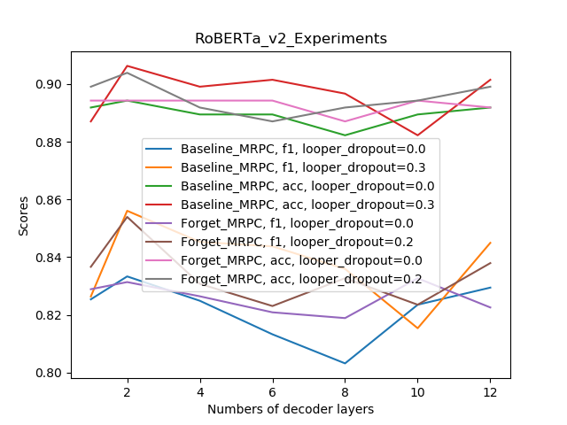

## Usage

**Model Training** Example: Run base model on CoLA task using GPU No. 3:
`./script_glue_base/CoLA.sh 3` (no need for `sh xx.sh`, it will be problematic with zsh)

**Handling Forgetting** Scripts are in `script_glue_base_forget`. The function is implemented in `mymodule/sentence_prediction_fg.py` (`train_step`) and `mymodule/sentence_prediction_fg_cri.py` (`forward`). 
*TODO*: WSC is not implemented, since it uses different `task` and `criterion` file. 

**Create Submission File** `python eval_glue.py --task TASK_NAME --ckpdir path/to/checkpointpython eval_glue.py --task TASK_NAME --ckp path/to/checkpoint.pt`, the script is `./script_glue_base/create_submit.sh GPU_ID`

*TODO* Large model, the distibuted data parallel is problematic. 

## Base

| Model        | MNLI      | QNLI | QQP       | RTE  | SST-2| MRPC      | CoLA | STS-B     | WSC  |
|---|---|---|---|---|---|---|---|---|---|
| base      dev | 87.6,87.5 | 92.6 | 91.8,89.0 | 79.1 | 96.0 | 88.0,81.7 | 59.8 | 89.7,89.3 | 82.1 |
| base_v2   dev |           |      |           |      |      | 89.7,83.3 |      |           |      |
| forget    dev | 87.6,87.3 | 92.5 | 91.8,89.1 | 79.8 | 95.9 | 87.4,80.9 | 60.8 | 89.4,89.5 |      |
| forget_v2 dev |           |      |           |      |      | 89.4,83.3 |      |           |      |
| mtvat     dev | 88.1,87.6 | 92.9 | 91.9,89.2 | 80.6 | 96.2 | 87.8,81.9 | 60.3 | 89.8,89.3 |      |

| V2 Model Variation        | MNLI      | QNLI | QQP       | RTE  | SST-2| MRPC      | CoLA | STS-B     | WSC  |
|---|---|---|---|---|---|---|---|---|---|
| base                                     dev |  |      |           |      |      | 89.7,83.3 |      |           |      |
| forget                                   dev |           |      |           |      |      | 89.4,83.3 |      |           |      |
| base w/pooler_dropout=0.3                dev | 87.7 |      |           |      |      | 90.6,85.6 |      |           |      |
| forget w/pooler_dropout=0.3              dev |           |      |           |      |      | 90.4,85.4 |      |           |      |
| base w/stable_init,pooler_dropout=0.2    dev | 88.0 |      |           |      |      | 90.4,84.4 |      |           |      |
| forget w/stable_init,pooler_dropout=0.2  dev |           |      |           |      |      |  |      |           |      |

## Large

| Model        | MNLI      | QNLI | QQP       | RTE  | SST-2| MRPC      | CoLA | STS-B     | WSC  |
|---|---|---|---|---|---|---|---|---|---|
| large    dev | 90.1,90.2 | 94.7 | 92.2,89.7 | 90.3 | 96.5 | 89.6,84.0 | 70.5 | 91.9,91.9 | 88.4 |
| mtvat    dev |  | 94.6 | 92.2,89.7 | 91.0 | 96.7 | 89.7,84.6 | 68.2 | 91.9,91.8 |      |

## Reported Results

##### Results on GLUE tasks (dev set, single model, single-task finetuning)

Model | MNLI | QNLI | QQP | RTE | SST-2 | MRPC | CoLA | STS-B
---|---|---|---|---|---|---|---|---
`roberta.base` | 87.6 | 92.8 | 91.9 | 78.7 | 94.8 | 90.2 | 63.6 | 91.2
`roberta.large` | 90.2 | 94.7 | 92.2 | 86.6 | 96.4 | 90.9 | 68.0 | 92.4
`roberta.large.mnli` | 90.2 | - | - | - | - | - | - | -

##### Results on superGLUE tasks (dev set, single model, single-task finetuning

Model | BoolQ | CB | RTE
---|---|---|---
`roberta.mnli.base` | 82.2 | 96.8 | 85.8 

## Reported Statistics

[RoBerta v2 model statistics](https://gtvault-my.sharepoint.com/:x:/g/personal/cliang73_gatech_edu/EUIZOT4TuzBBhvWVaQvLiLsB1s9jMTmeQfzLpXPZCu9PzQ?e=pbm4PT)

## MTVAT
## Base

| Model | MNLI | QNLI | QQP | RTE | SST-2 | MRPC | CoLA | STS-B|
|---|---|---|---|---|---|---|---|---|
|`roberta.base`  | 87.6, ? | 92.8 | 91.9 | 78.7 | 94.8 | 90.2      | 63.6 | 91.2|
|ours            |         | 92.8 |      | 82.6 | 95.8 | 90.2,84.5 |      |     |
|`roberta.large` | 90.2    | 94.7 | 92.2 | 86.6 | 96.4 | 90.9      | 68.0 | 92.4|

## Large

|method          | MNLI-match | MNLI-mismatch | QNLI | QQP   | RTE   | SST-2    | MRPC         | CoLA          | STS-B  |
|----------------|------------|---------------|------|-------|-------|----------|--------------|---------------|--------|
|baseline (dev)  |0.9024      |0.9021         |0.9478|0.9239 |0.9132 |0.9643    |0.9038,0.8539 |0.8636,0.6660  |0.019   |
|baseline (test) |            |               |      |       |       |          |0.8876,0.8391 |               |        |
|ours            |            |               |      |       |0.9167 |          |0.9255,0.8819 |0.8740,0.6919  |        |
|ours            |            |               |      |       |       |0.9704(t) |0.8986,0.8453 |               |        |
